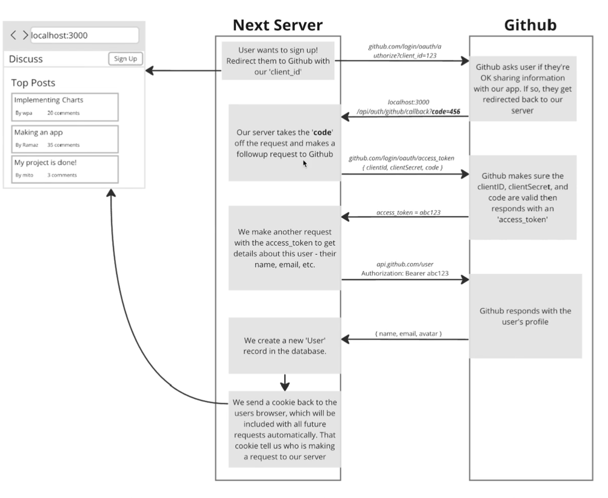
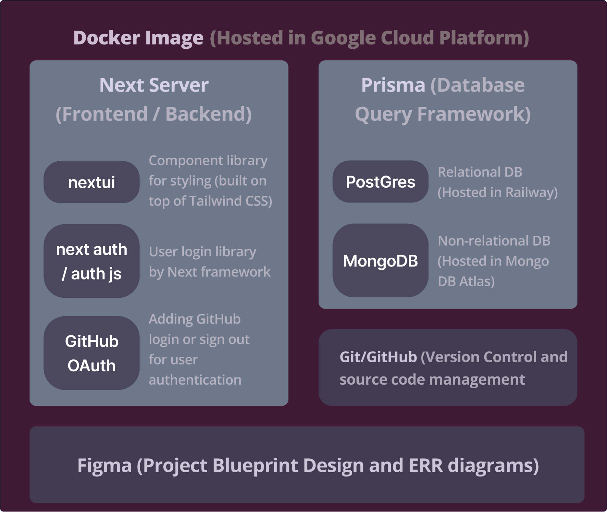
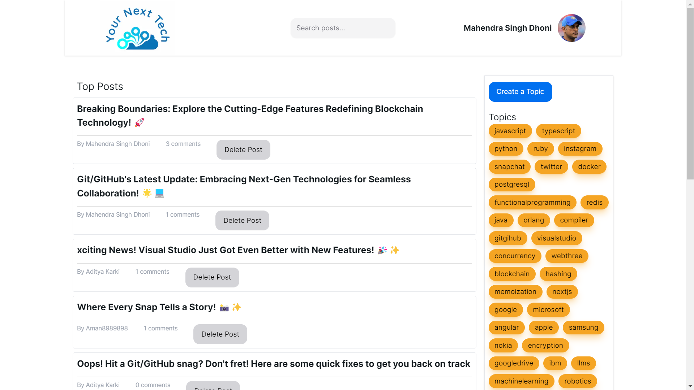
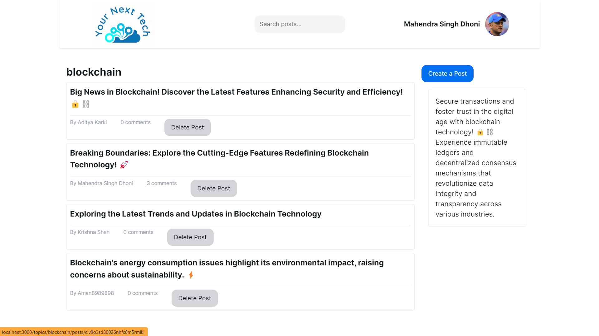
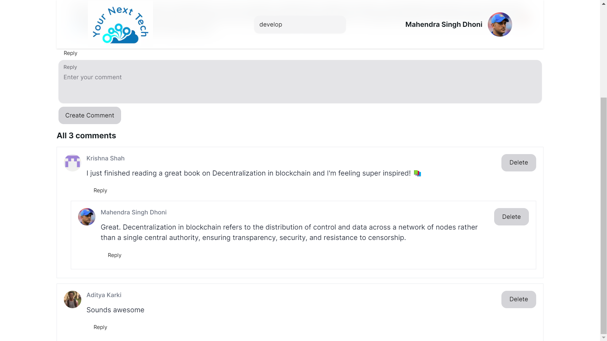
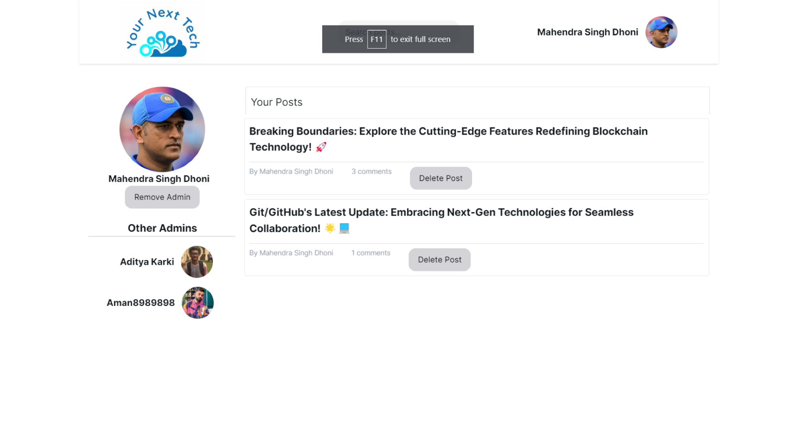
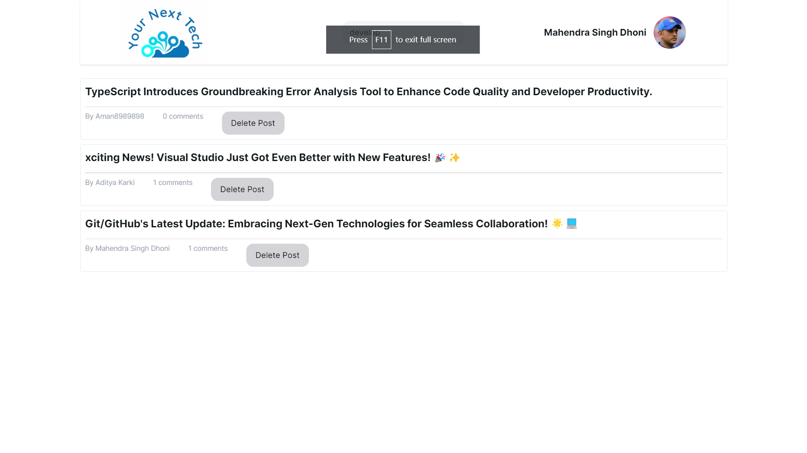

##  Your Next Tech 
A secure space for developers and tech enthusiasts to connect, share, and learn.

## 🔍 Overview
YourNextTech is a **Next.js** powered social platform for the tech community. It facilitates knowledge sharing, innovation discussions, and exploration of cutting-edge topics like AI and ML. Key features include GitHub OAuth, dynamic content feeds, and an interactive comment system.

## ✨ Features
- **User Authentication**: GitHub OAuth for secure sign-in.
- **Dynamic Content Feeds**: Create, edit, and delete posts/topics/comments.
- **Search Functionality**: Intelligent keyword-based search.
- **User Profile Management**: View profile, manage posts, and request admin access.
- **3NF Relational Database**: Optimized relational database design ensuring minimal redundancy and improved data integrity.

**Source Code**
- **[actions/](https://github.com/KarkiAdit/your-next-tech/tree/master/src/actions)**: Server-side backend logic.
- **[app/](https://github.com/KarkiAdit/your-next-tech/tree/master/src/app)**: Frontend data processing and presentation.

## 🗂️ High-Level Design
- **Frontend**: React and Next.js with NextUI for styling.
- **Backend**: Next.js server with Prisma ORM.
- **Databases**:
  - **PostgreSQL**: Structured data storage.
  - **MongoDB**: Non-relational admin data and backups.
- **Cloud Hosting**: Containerized with Docker and deployed on Google Cloud Platform.

The following diagram illustrates the architecture:

## 🎥 Demo
1. **Landing Page**: Displays trending posts and GitHub profile integration after login.

2. **Post/Topic/Comments Pages**: Easy creation and management of posts, topics, and comments.

3. **Admin Features**: Add/remove admins through the user profile page.

4. **Advanced Search**: Search based on post Title.

## ⚙️ Developer Setup
1. Clone the repository from GitHub.
2. Install dependencies using `npm install`.
3. Configure PostgreSQL and MongoDB connection strings.
4. Run the app locally with `npm run dev`.

## 🧑‍💻 Technologies Used
- **Frontend**: React, Next.js, NextUI
- **Backend**: Next.js, Prisma
- **Databases**: PostgreSQL (Railway), MongoDB (Atlas)
- **Hosting**: Google Cloud Platform
- **Version Control**: Git/GitHub with CI/CD via GitHub Actions

## 📚 Acknowledgments
- [Nextjs Docs](https://nextjs.org/learn/react-foundations/what-is-react-and-nextjs)
- [Prisma ORM](https://www.prisma.io/docs/orm/overview/introduction/what-is-prisma)
- [PostgreSQL Docs](https://www.postgresql.org/docs/current/tutorial-install.html)
